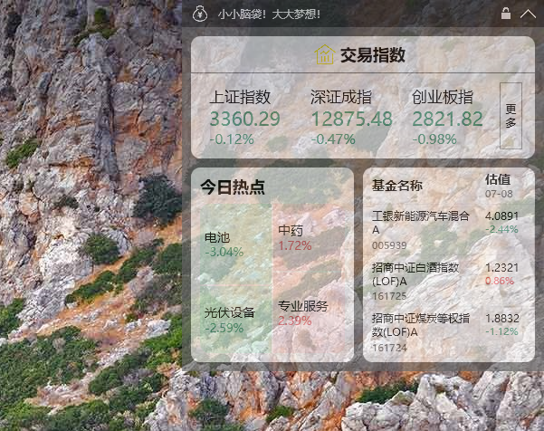
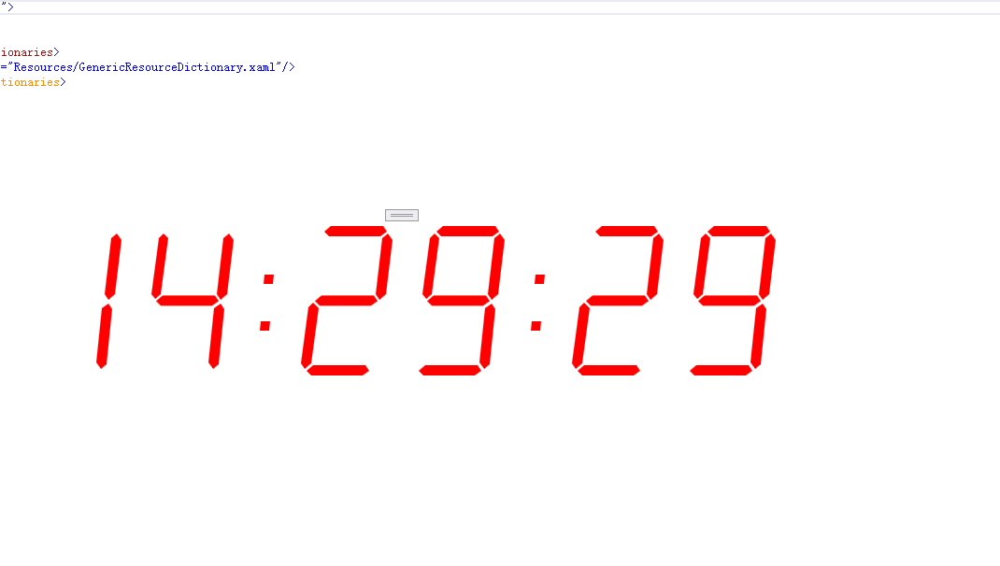
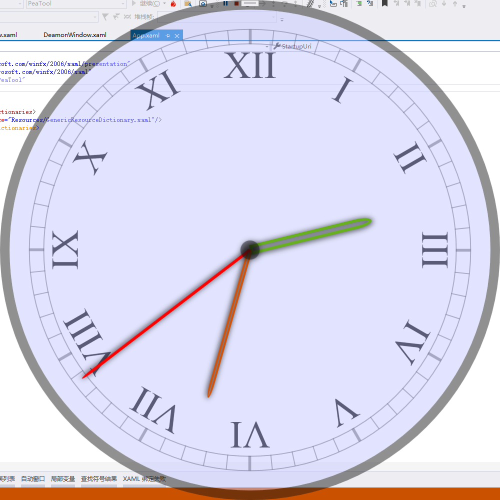

# 对WPF的一些尝试

### 实时交易数据工具
路径：PeaTool\RunToRichWindow.xaml
截图：
功能：
- 实时同步自选指数信息或股票价格
- 列出当前热门版块
- 实时同步自选基金及相应涨幅
- 可以设置透明度
- 桌面置顶，可移动，可固定，右上角可收起展开

### 电子时钟模拟
路径：PeaTool\DigitalClock.xaml
截图：
功能：
- 在桌面最上方显示数据模拟时钟（在所有应用的顶层）
- 可拖拽移动

### 另一个时钟模拟
路径：PeaTool\Clock.xaml
截图：
功能：
- 显示数据模拟时钟（随系统时间变化）
- 可拖拽移动
